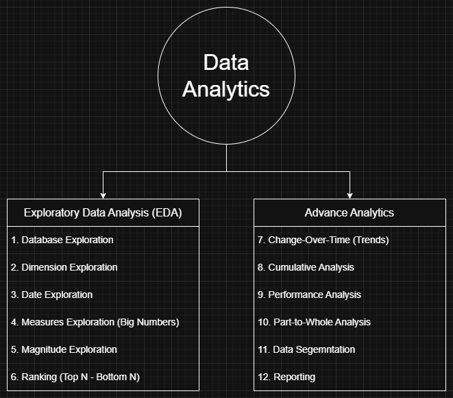

# Data Analytics Project

Welcome to the **Data Analytics** repository!
A comprehensive collection of SQL scripts for data exploration, analytics, and reporting. These scripts cover various analyses such as database exploration, measures and metrics, time-based trends, cumulative analytics, segmentation, and more.  

This repository contains SQL queries designed to help data analysts and BI professionals quickly explore, segment, and analyze data within a relational database. Each script focuses on a specific analytical theme and demonstrates best practices for SQL queries.

---
## Data Analysis Roadmap

The analysis for this project follows this roadmap:

---
## Project Overview

This project involves:

1. **Exploratory Data Analysis** 
2. **Advance Data Analysis** 
3. **Reporting**: Collection of analyses and explorations consolidated into views for end users.

---

## License

This project is licensed under the [MIT License](LICENSE). You are free to use, modify, and share this project with proper attribution.

## About Me

Hi there! I'm **Gaspar Juico**, a Data Analyst with a strong interest in turning raw data into clear, actionable insights. I enjoy cleaning and analyzing data, and presenting results that help drive better decisions.

